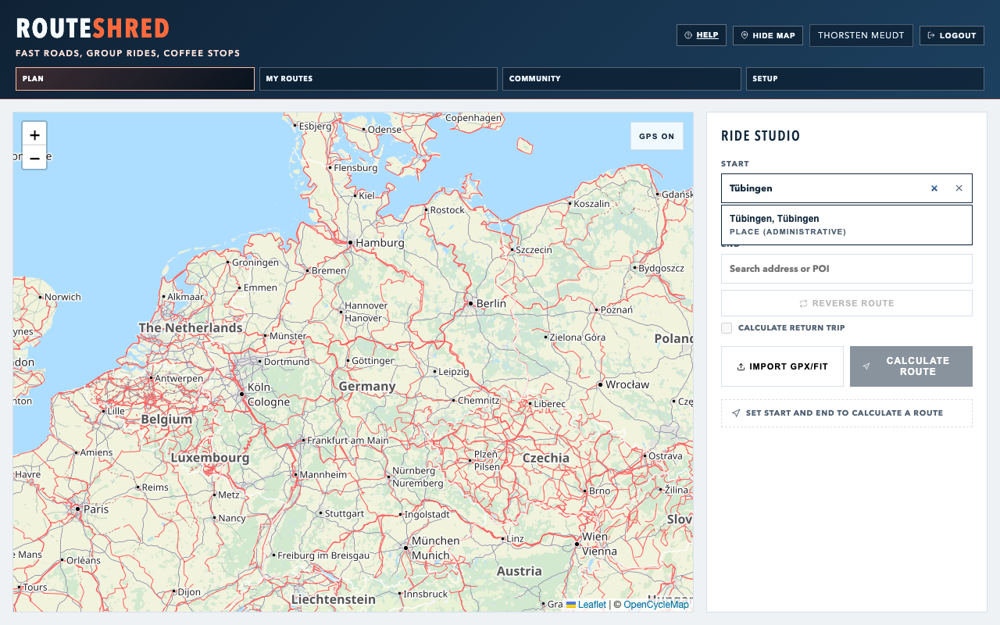
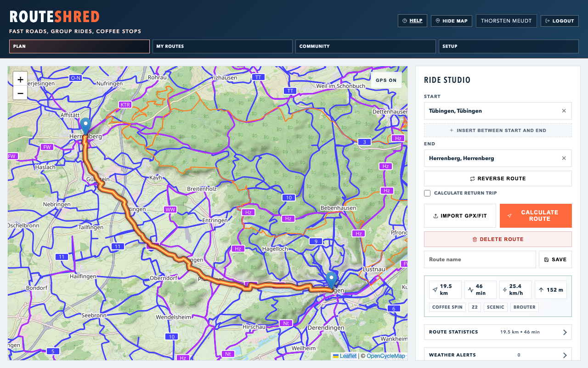
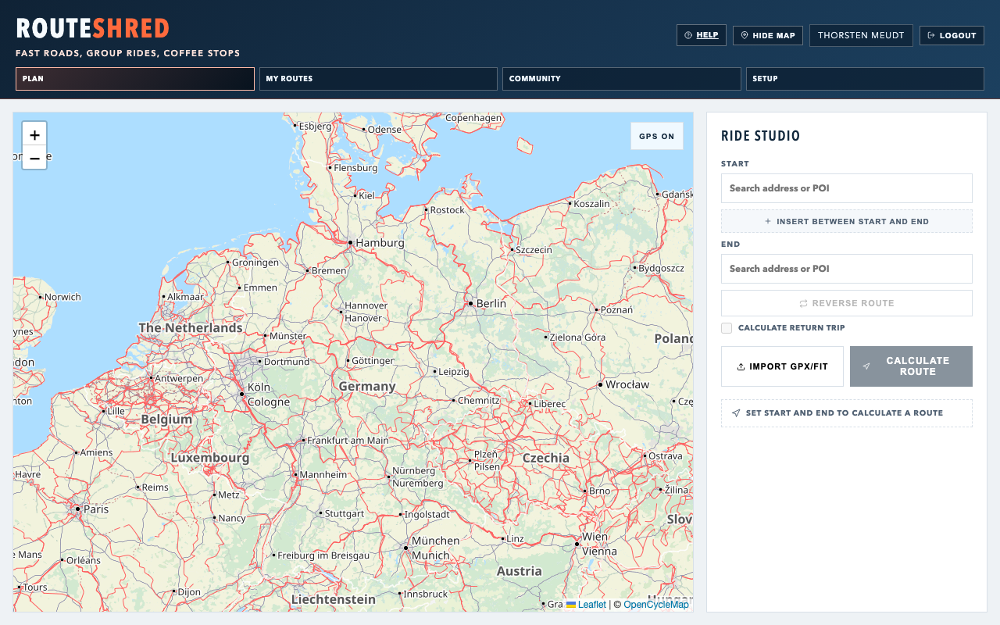
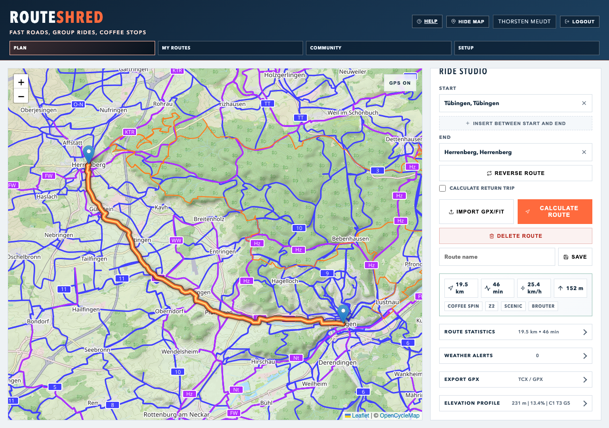
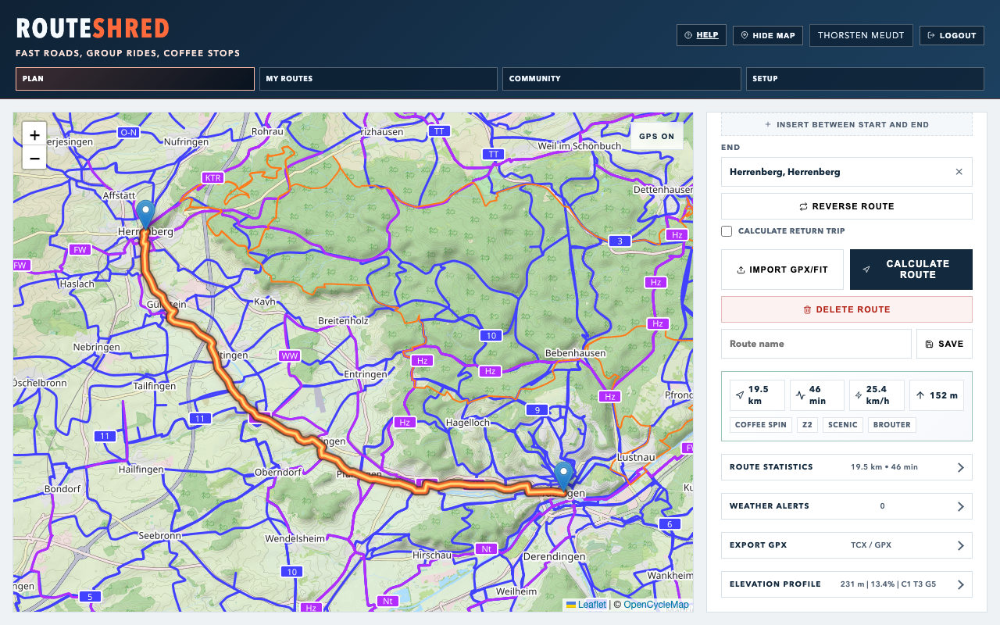
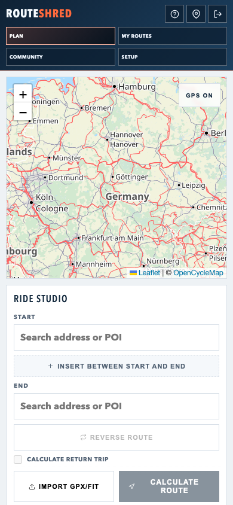
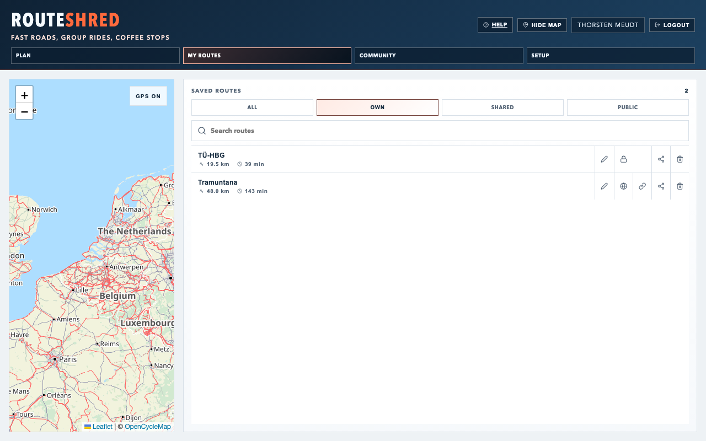
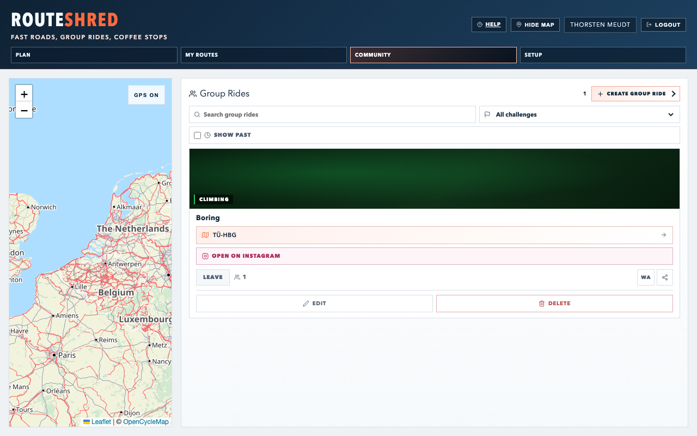
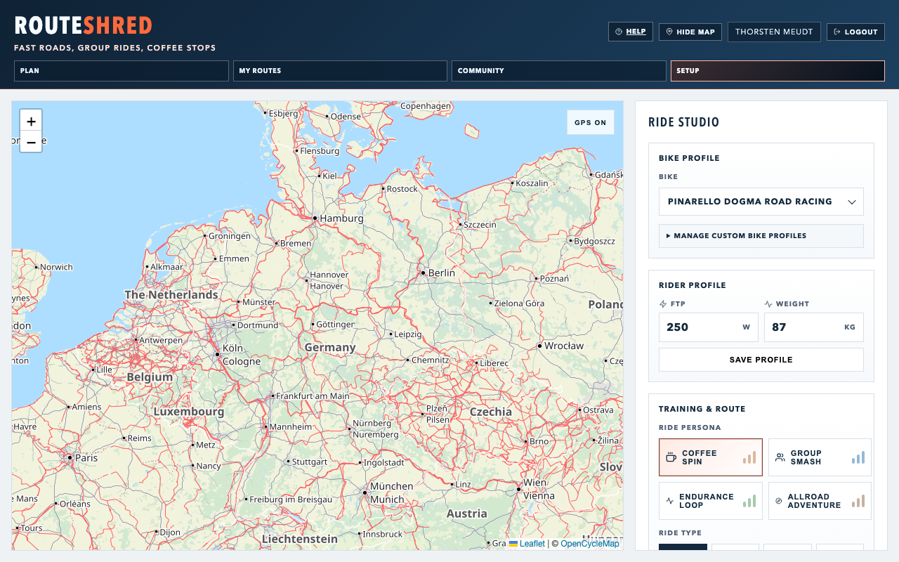
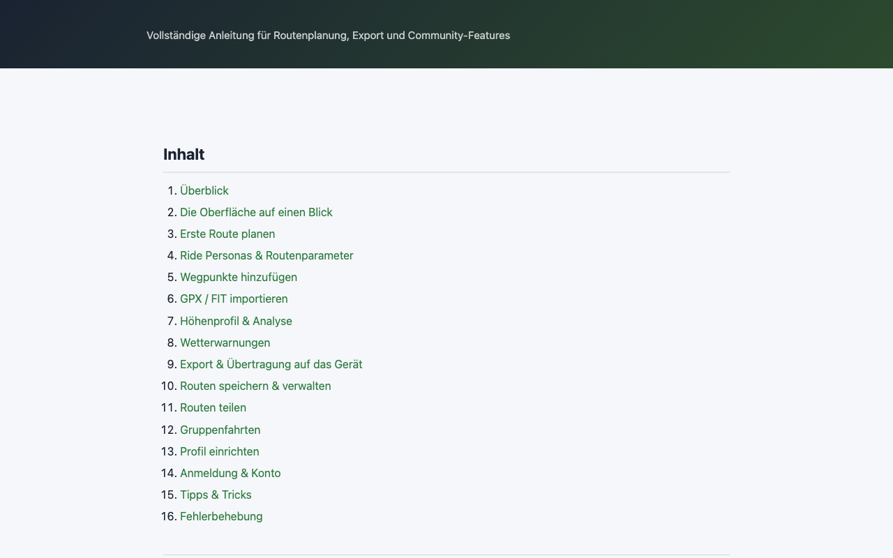

# RouteShred — User Manual

## Contents

1. [Overview](#1-overview)
2. [The Interface at a Glance](#2-the-interface-at-a-glance)
3. [Planning Your First Route](#3-planning-your-first-route)
4. [AI Roundtrip Planning](#4-ai-roundtrip-planning)
5. [Ride Personas & Route Parameters](#5-ride-personas--route-parameters)
6. [Adding Waypoints](#6-adding-waypoints)
7. [Importing GPX / FIT](#7-importing-gpx--fit)
8. [Elevation Profile & Analysis](#8-elevation-profile--analysis)
9. [Weather Alerts](#9-weather-alerts)
10. [Export & Device Transfer](#10-export--device-transfer)
11. [Saving & Managing Routes](#11-saving--managing-routes)
12. [Sharing Routes](#12-sharing-routes)
13. [Group Rides](#13-group-rides)
14. [Setting Up Your Profile](#14-setting-up-your-profile)
15. [Login & Account](#15-login--account)
16. [Tips & Tricks](#16-tips--tricks)
17. [Troubleshooting](#17-troubleshooting)

---

## 1. Overview

RouteShred is a self-hosted bike route planner for road and gravel riders. It combines BRouter-based routing, elevation profiles, weather alerts, and power-zone calculations in a single web application.

**What works without an account:**
- Plan and calculate routes
- View elevation profiles and terrain analysis
- Check weather alerts
- Download routes as GPX or TCX
- Send routes directly to the Wahoo Companion App (mobile)

**What an account additionally enables:**
- AI Roundtrip planning from a destination area, time budget, bike profile, and persona
- Save routes permanently
- Load and share saved routes
- Create, join, and comment on group rides
- Save a rider profile (FTP, weight, bike type)

---

## 2. The Interface at a Glance


*The main view with sidebar and map.*

On desktop, the app consists of two resizable areas:

```
┌─────────────────────────────────────────────────────────────┐
│  [Plan]  [My Routes]  [Community]  [Setup]                  │  ← Tabs
├──────────────────────┬──────────────────────────────────────┤
│                      │                                       │
│  Sidebar             │            Map                        │
│  (active tab)        │         (Leaflet)                     │
│                      │                                       │
└──────────────────────┴──────────────────────────────────────┘
```

- **Plan** — Plan a route, elevation profile, export. Always visible.
- **My Routes** — Saved routes. Only visible when logged in.
- **Community** — Group rides. Only visible when logged in.
- **Setup** — Manage bike profiles, FTP, weight. Always visible.

Drag the divider between map and side panel on desktop to give more space to either the map or the active tab. RouteShred remembers the chosen width locally in your browser.

On phones and narrow tablets, RouteShred switches to a mobile layout: the map stays as the main visual surface and the active tab appears as a bottom sheet below it. The sheet has three quick heights — map focus, planning, and details — so you can keep the map large while still reaching route inputs, saved routes, and community tools. This keeps route planning touch-friendly without squeezing the desktop sidebar into a narrow column.

You can click anywhere on the map to set the start or destination. Right-clicking a marker provides additional editing options.

---

## 3. Planning Your First Route



*Entering start/destination with autocomplete suggestions.*

### Step 1 — Enter Start and Destination

The **Plan** tab has two address fields: Start and Destination.

**By typing:**
Enter an address, place name, or POI term (e.g. "café", "bike shop"). The suggestion list combines Nominatim addresses with Overpass POIs.

**By clicking the map:**
Click directly on the map. If no start is set yet, the first click becomes the start, the second the destination.

**By GPS:**
Click the **GPS** button next to Start, Destination, or any waypoint to use your current position for that field. This does not interfere with the address/POI search; it simply fills that one field with "Current location".

On iPhone/iPad, Safari must be allowed to use location services for the website. Check iOS Settings → Privacy & Security → Location Services → Safari Websites if the browser says GPS access is blocked.

### Step 2 — Choose a Ride Persona or Parameters

Select one of the four ride personas (Coffee, Bunch, Endurance, Gravel) or manually configure the bike type, route preference, and ride type. Details → [Section 5](#5-ride-personas--route-parameters).

### Step 3 — Calculate

Click **Calculate**. RouteShred sends the request to the configured routing engine, fetches the elevation profile from Open-Meteo, and calculates weather alerts. The route appears as a blue line on the map with analysis below.



*Result after route calculation.*

### Step 4 — Return Route (optional)

Enable **Include return route** to automatically calculate the return trip on the same or an alternative path. The total distance doubles accordingly.

---

## 4. AI Roundtrip Planning

> AI Roundtrip requires an account and must be enabled server-side with `AI_ROUNDTRIP_ENABLED=true` and `OPENAI_API_KEY`.

The **AI Roundtrip** in the Plan tab creates a compact loop based on:

- **Start point** — must be set first
- **Destination area** — e.g. "Black Forest", "café", "viewpoint". The destination area serves as an anchor for the loop, not necessarily as the first waypoint.
- **Time budget** — approximate time available in minutes
- **Bike profile** — selected in the Plan tab for this route
- **Ride persona** — Coffee, Bunch, Endurance, or Gravel

OpenAI only generates structured loop ideas. The actual route is then calculated by the routing engine. If AI planning is too slow, RouteShred automatically falls back to a robust default loop so the process doesn't fail entirely.

The calculated route is loaded onto the map like a normal route and can then be edited, exported, or saved.

### Time Budget Tuning

AI waypoints are only rough spatial anchors. The actual road route may end up longer than planned. RouteShred therefore automatically tries more compact loops when the calculated duration exceeds the time budget by too much. The tolerance is controlled server-side via `AI_ROUNDTRIP_MAX_TIME_FACTOR` (default: `1.18`). The destination area is used as a spatial anchor; the actual waypoints are usually placed around it.

---

## 5. Ride Personas & Route Parameters



*Persona selection and route parameters in the Plan tab.*

### Ride Personas

Personas are one-click presets that set `ride type` and `preference` simultaneously:

| Persona | Ride Type | Preference | Typical Use |
|---------|-----------|------------|-------------|
| ☕ Coffee Ride | Z2 | Scenic | Easy ride, low intensity |
| 👥 Bunch Ride | TT | Fastest | Group training, flat roads |
| ⚡ Endurance | SST | Scenic | Endurance session, moderate intensity |
| 🪨 Gravel | Z2 | Offroad | Gravel roads, forest tracks |

### Manual Parameters

**Bike profile** — Choose the bike/routing profile for this specific route directly in the Plan tab. The available options come from the built-in BRouter profiles and your custom profiles from Setup.

**Route preference:**
- **Fastest** — shortest time, prefers main roads
- **Scenic** — prefers cycle paths, minor roads, panoramic routes
- **Offroad** — prefers gravel and unpaved tracks

**Ride type** (Z2 / SST / TT / Threshold) — only determines the power zone preview, not the route itself. The displayed wattage is based on your FTP (configurable in the Setup tab).

### Power Zone Preview

Below the persona selection, the target watt range for the current zone is displayed:

| Zone | % FTP | Typical at 250 W FTP |
|------|-------|----------------------|
| Z2 | 56–75 % | 140–188 W |
| SST | 84–97 % | 210–243 W |
| TT | 105 % | ~263 W |
| Threshold | 98–102 % | 245–255 W |

---

## 6. Adding Waypoints

Add intermediate stops to control the route path.

**By clicking the map:** After setting start and destination, every additional click adds a waypoint.

**By address input:** Click the **+** icon in the waypoint bar and type an address.

**Reordering:** Drag waypoints by their handle in the sidebar to reorder them.

**Removing a waypoint:** Click the **×** next to the waypoint or drag the marker off the map.

> After any change to waypoints, click **Calculate** again to update the route.

---

## 7. Importing GPX / FIT

You can import an existing route from Komoot, Strava, Garmin Connect, or any other app.

**Supported formats:** `.gpx`, `.fit`

**How to:**
1. Click the import icon (upward arrow) in the Plan tab
2. Select a `.gpx` or `.fit` file
3. RouteShred automatically extracts start, destination, and waypoints
4. The imported points are loaded into the input fields — you can adjust them
5. Click **Calculate** to recalculate the route with your current profile settings

> **Note:** The imported file only determines the waypoints, not the actual routing. BRouter recalculates the optimal route between these points according to your bike and preference profile.

---

## 8. Elevation Profile & Analysis



*Elevation profile with key metrics and chart.*

After calculating a route, the elevation profile appears as an interactive chart in the Plan view. The Setup view focuses on rider and bike profile settings and does not show the elevation chart.

### Reading the Elevation Profile

- **X-axis** — distance in kilometres
- **Y-axis** — elevation in metres above sea level
- **Hover** — shows exact elevation and distance at the cursor position
- The corresponding point is simultaneously highlighted on the map

### Key Metrics

Above the chart the following are displayed:
- **Distance** — total length in km
- **Ascent / Descent** — cumulative elevation gain/loss
- **Estimated time** — based on the routing profile
- **Highest point / Lowest point**

### Terrain Analysis

Below the elevation profile, the **terrain analysis** shows the surface breakdown of the route:
- Asphalt, gravel, forest and field tracks, trails
- Share as percentage and kilometres
- Colour-coded bar chart

---

## 9. Weather Alerts

RouteShred checks the Open-Meteo weather forecast along the route during calculation and shows alerts when relevant conditions are predicted:

| Alert | Trigger |
|-------|---------|
| 💨 Headwind / Tailwind | Wind speed above threshold, direction relative to riding direction |
| 🌧 Rain | High precipitation probability |
| 🌡 Heat | Temperature above threshold |
| ☀️ UV | High UV index |
| ↔️ Crosswind | Strong lateral wind |

Alerts appear directly below the persona selection. Click an alert to see details about the affected route position.

> No alerts = no significant conditions predicted. Weather data refers to the current time of day, not a planned departure time.

---

## 10. Export & Device Transfer



*TCX/GPX export and device transfer.*

### Download TCX

For Wahoo ELEMNT, Garmin, and other devices. Click **Export TCX** — the browser downloads the file. Transfer it via the device app or Garmin Connect / Wahoo Cloud.

### Download GPX

Universal format, compatible with virtually all apps and devices. Click **Export GPX**.

### Send Directly to Wahoo ELEMNT (mobile, recommended)

The fastest way on mobile devices:

1. Calculate a route
2. Tap **Send to Wahoo**
3. Your operating system's native share sheet opens
4. Select the **Wahoo Companion App**
5. The app receives the GPX file and syncs it to the device

> **Requirements:**
> - Mobile browser (iOS Safari, Chrome on Android)
> - Wahoo Companion App installed and connected to your ELEMNT
> - The button only appears when the browser supports the Web Share API with file support

> **If Wahoo doesn't appear in the share sheet:** Make sure the Wahoo Companion App is registered for file imports. Open the app once and manually import a GPX file — iOS/Android will then recognise the app as a handler.



*Mobile use including share flow to Wahoo.*

---

## 11. Saving & Managing Routes



*The "My Routes" tab with saved rides.*

> Saving requires an account (login).

### Saving a Route

1. Calculate a route
2. Enter a name in the field at the top of the Plan tab
3. Click **Save**
4. The route immediately appears in the **My Routes** tab

### My Routes

The **My Routes** tab shows all your saved routes as well as routes others have shared with you. You can search by route name and filter by a start region: enter a place/address, choose a radius, and only routes whose start point lies within that area are shown.

**Load a route:** Click on a route in the list. It loads onto the map and can be edited or exported straight away.

**Rename:** Click the pencil icon next to the route name, enter the new name, confirm with Enter.

**Delete:** Click the bin icon. This action cannot be undone.

**Visibility:**
- 🔒 **Private** — only you can see the route (default)
- 🌍 **Public** — anyone with the link can load the route (no login required)
- 👤 **Shared** — only specific users have access

---

## 12. Sharing Routes

### Public Link

1. Set the route to **Public** in **My Routes**
2. Click **Copy link**
3. Share the link via message, email, or in Strava comments
4. Recipients open the link — the route loads without login

### Sharing with Individual Users

1. Click **Share** in the route detail view
2. Enter the recipient's email address or username
3. Click **Add** — the user sees the route in their **My Routes** tab

The route stays under your control. The recipient can view and load it, but cannot edit or delete it.

---

## 13. Group Rides



*Community tab with public group rides.*

The **Community** tab shows all public group rides and the rides you are participating in. Past rides are hidden by default and can be shown explicitly. The cards use challenge-coded visuals, show participants, comments, linked routes, and optional Instagram links.

### Creating a Group Ride

1. Click **+ New Group Ride** in the Community tab
2. Fill in the following fields:
   - **Title** — e.g. "Sunday Road Ride"
   - **Description** — details about pace, format, refreshments
   - **Date & Time** — start time
   - **Meeting point** — address or description
   - **Route** (optional) — select one of your saved routes
   - **Instagram link** (optional) — link a post/reel for extra context
   - **Visibility** — Public or Private
3. Click **Create**

### Joining / Leaving

Click on a public group ride and then click **Join**. Your name appears in the participants list. Click **Leave** to remove yourself.

### Commenting

Each group ride has a comment section for organisational notes (max. 500 characters per comment). Only logged-in users can comment. Participants are shown on the ride card so it is clear who has joined.

### Editing / Deleting a Group Ride

Only the creator can edit or delete a group ride. Click the pencil icon next to the title.

---

## 14. Setting Up Your Profile



*Setup tab with profile and bike settings.*

The **Setup** tab is where you configure your rider profile and manage custom bike profiles. The actual bike profile used for a planned route is selected in the **Plan** tab.

### FTP (Functional Threshold Power)

Your threshold power in watts — the power you can theoretically sustain for one hour.

- **Don't know yours?** Start with 200–250 W and adjust after an FTP test.
- **FTP test protocol:** 5 min easy → 5 min all-out (warm-up effort) → 10 min easy → 20 min as hard as possible → 5 min easy. 95 % of the 20-minute average power = FTP.

### Weight

Your body weight in kg. Currently stored for future W/kg calculations.

### Bike Profiles

Create, rename, edit, and delete custom BRouter profiles. These profiles then appear in the Plan tab where you choose the active bike for the route you are planning.

### Display Name

How you appear in group rides and shared routes. Can differ from your account name.

### Saving Changes

Click **Save Profile**. The values are immediately applied to the power zone preview.

---

## 15. Login & Account

RouteShred uses Keycloak for authentication. Click **Login** in the top right.

### Creating a New Account

If registration is enabled in Keycloak, select **Register** on the Keycloak login page. You will need:
- Username
- Email address
- Password (min. 8 characters)

After registration you are logged in immediately. On self-hosted private instances the administrator may disable public registration and create users manually.

### Staying Logged In

The Keycloak token is time-limited. After extended inactivity you will be logged out automatically. Click **Login** again to renew the session — your routes and data are preserved.

### Logging Out

Click your username in the top right → **Logout**.

### Using Without an Account

You can use RouteShred fully without an account: route planning, analysis, export, and Wahoo transfer all work anonymously. Only saving, My Routes, and Community are unavailable.

---

## 16. Tips & Tricks

**Quick start by clicking the map:**
Click directly on the map without typing any address. The first click sets the start, the second the destination.

**Start from here:**
Use the GPS button on Start, Destination, or any waypoint to fill that field with your current position. This works best on HTTPS and requires browser location permission.

**Map fullscreen:**
Use the fullscreen button on the map for route inspection on mobile. On iOS Safari, fullscreen is implemented as an in-app fullscreen mode because browser-native fullscreen support is limited.

**Testing an alternative route:**
After calculating, change the preference (e.g. from Scenic to Fastest) and click Calculate again — instant comparison.

**Custom BRouter profiles:**
Place your own `.brf` files in `brouter-data/customprofiles/`. They automatically appear in the bike type selection under the filename (without the `.brf` extension).

**Return route as a separate export:**
When the return route is enabled, RouteShred exports the outbound and return legs as a combined GPX/TCX file.

**Warming up the tile cache:**
Before heading out, zoom through the entire route area once — map tiles are cached server-side and load much faster afterwards.

**Keep the browser tab open:**
The planning state (start, destination, waypoints) is preserved in the browser tab as long as you don't close the page. There is no implicit auto-save.

---

## 17. Troubleshooting



*Help/support section for common issues.*

### Route Cannot Be Calculated

1. **Health check:** `curl http://localhost:5050/api/health` — is the backend status `OK`?
2. **Check BRouter:** `curl http://localhost:17777/brouter/version` — is BRouter running?
3. **Missing segments:** Is `BROUTER_AUTO_FETCH_SEGMENTS=true` set? On the first calculation through a new area, BRouter downloads the `.rd5` tile — this can take 5–30 seconds the first time.
4. **OSRM fallback:** If BRouter is unavailable and `BROUTER_FALLBACK_TO_OSRM=true` is set, OSRM is used. The route may differ slightly.

### Elevation Profile Is Flat / Empty

- Open-Meteo not reachable? → Check backend internet access
- `ROUTESHRED_CACHE_DIR` not writable? → Check directory permissions
- Open-Elevation is attempted as a fallback; if both fail, the profile remains empty

### Wahoo Button Does Not Appear

The button is only visible on devices where the browser reports Web Share API support with file sharing (`navigator.canShare({ files: [...] })`). This works in:
- Safari on iOS 15+
- Chrome on Android 86+

Not supported: desktop browsers, Firefox on iOS.

### GPS Says Access Is Blocked

1. Confirm the app is opened via `https://` or `localhost`. iOS Safari blocks website geolocation in insecure contexts.
2. iOS: Settings → Privacy & Security → Location Services → Safari Websites → allow location while using Safari.
3. In Safari's website settings for your RouteShred domain, set Location to Ask or Allow.
4. If you previously tapped "Don't Allow", remove the website data for the domain and try again.
5. Private browsing and installed home-screen web apps can behave differently; test once in a normal Safari tab.

### Map Shows Only OpenStreetMap, Not OpenCycleMap

The backend tile proxy requires a Thunderforest API key. Check:
1. Is `THUNDERFOREST_API_KEY` set in `.env`?
2. Has the backend been restarted after the change?
3. Browser developer tools → Network → requests to `/api/tiles/...` — is the server returning 503?

### Login Fails / "Authentication error"

1. Is Keycloak running? → `docker compose ps keycloak`
2. Does `REACT_APP_KEYCLOAK_URL` in the frontend match the Keycloak address?
3. Browser console → network errors on `/auth/realms/routeshred/...`?
4. Cookie blockers or private browsing mode can block Keycloak redirects
5. If redirects fail after changing the public hostname, log the user out of all Keycloak sessions or clear old browser sessions so stale redirect URIs are not reused

### Saved Route Is Gone

Routes are stored as JSON files under `ROUTESHRED_ROUTES_DIR`. Check:
- Was the `data/` directory accidentally deleted?
- Was Docker stopped with `docker compose down -v` (which deletes volumes)?
- In Proxmox production: are the volume mounts in `docker-compose.proxmox.yml` correct?

---

*Further information for administrators and developers: [SETUP.md](./SETUP.md), [DEPLOYMENT.md](./DEPLOYMENT.md), [DEVELOPMENT.md](./DEVELOPMENT.md)*
